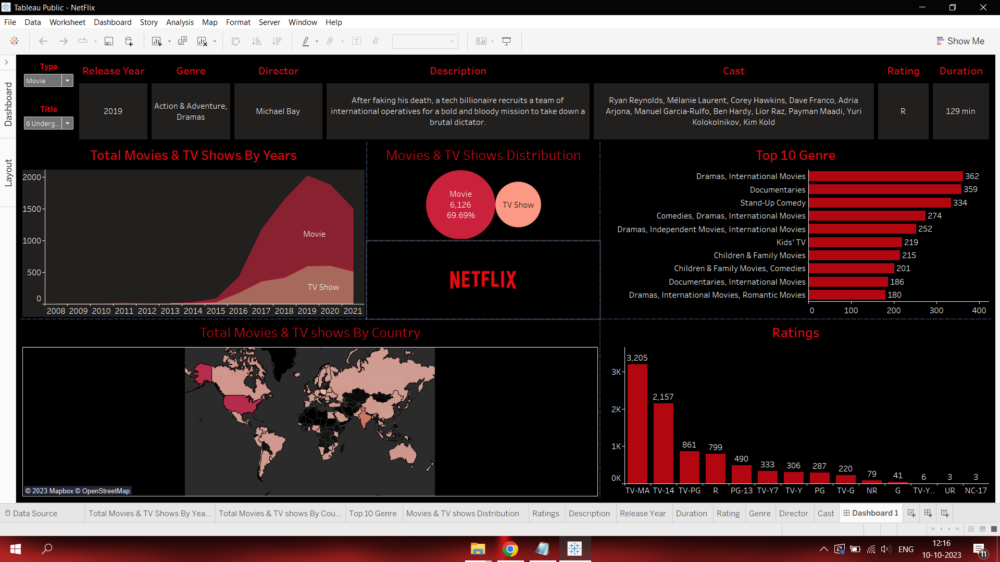
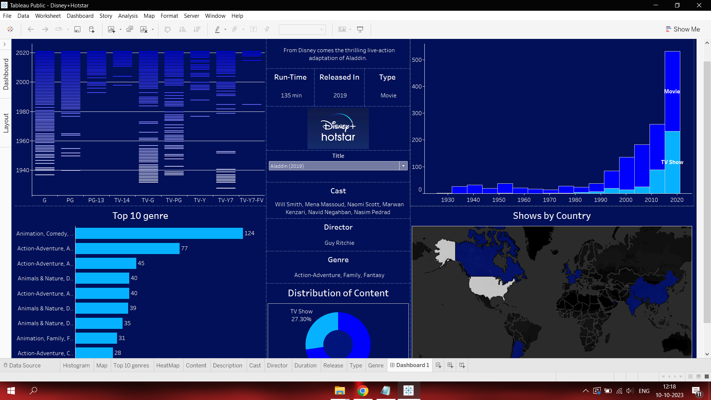
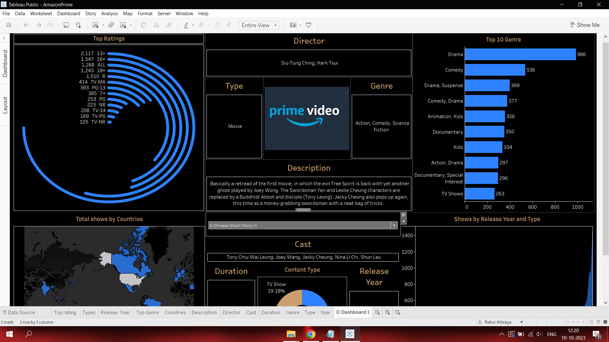

# OTT Analystics

Created insightful Dashboards for popular OTT platforms such as Netfilx, Amazon Prime Video and Disney+Hotstar using Tableau

## Tech 

* **Pandas :** Data Transformation
* **Tableau :** Data visualization

## Interactive Visualization Links

* **NetFlix :**[https://public.tableau.com/app/profile/rahul.athreya/viz/NetFlix_16963443692220/Dashboard1?publish=yes] 

* **AmazonPrime Video :**[https://public.tableau.com/app/profile/rahul.athreya/viz/AmazonPrime_16967472684410/Dashboard1?publish=yes]

* **Disney+Hotstar :** [https://public.tableau.com/app/profile/rahul.athreya/viz/DisneyHotstar_16968550933110/Dashboard1?publish=yes]
## Features

- Interactive 
- Unique Visualization Like Map plot,Radial Bar Chart,Donut chart, etc...
- Vast Information

## Screenshots

**For complete view of visualization visit the above mentioned links**
## Appendix
Datasets are obtained from kaggle

Datasets are Provided in [https://github.com/Rahulathreya45/OTT/tree/main/Dataset]

For Data Transformation you can refer to this collab notebook
[https://github.com/Rahulathreya45/OTT/blob/main/OTT.ipynb]
